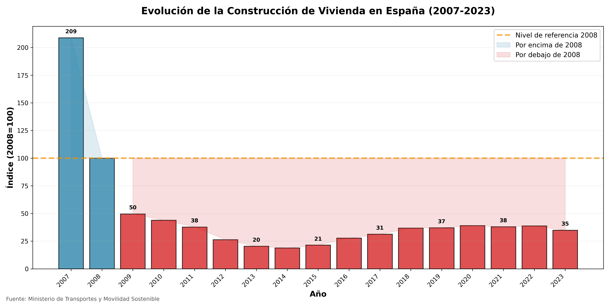
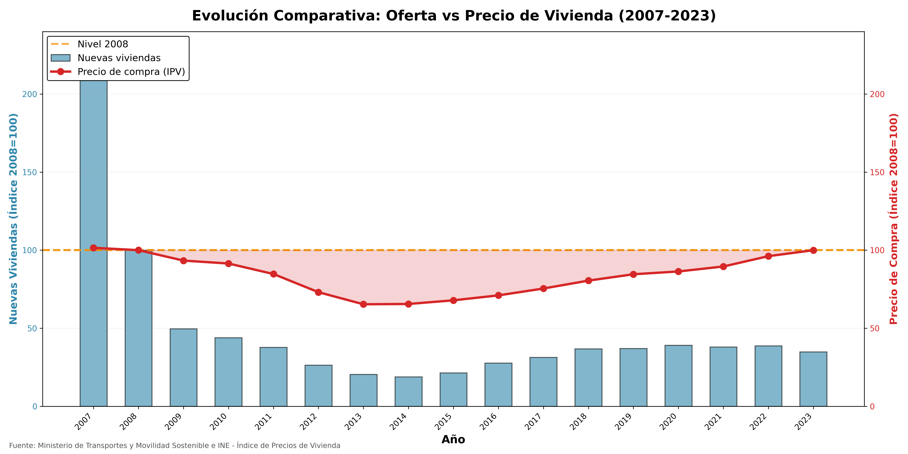
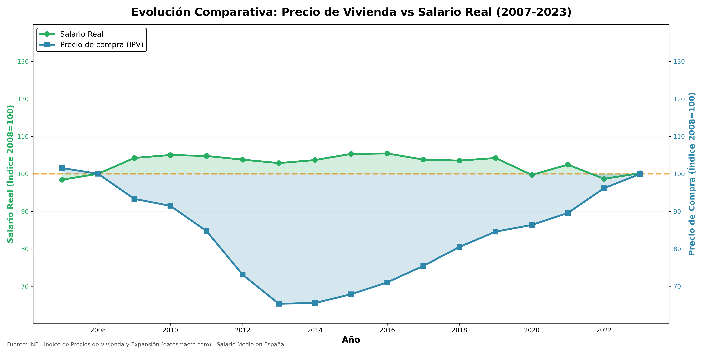
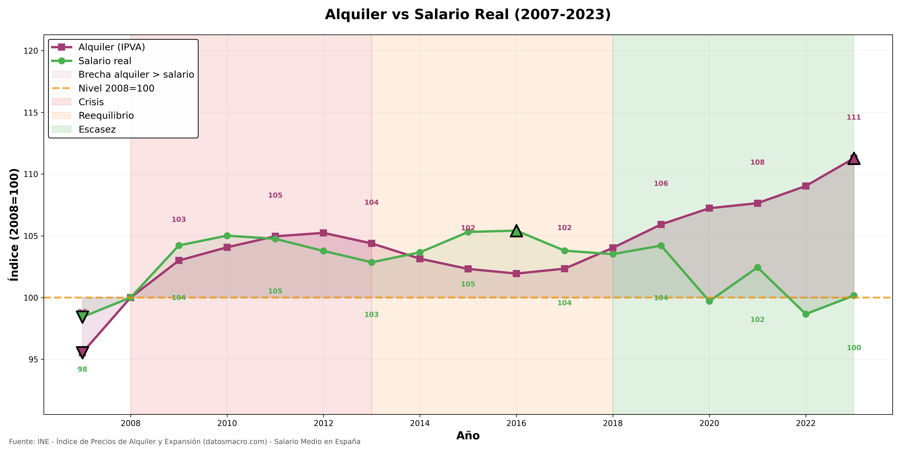

# 🏠 El colapso silencioso de la vivienda en España (2007–2023)

**Análisis de oferta, precios, salarios y alquiler**

📊 *Proyecto de Data Analysis con Python, Pandas y visualización para estudiar la crisis estructural de la vivienda en España.*

---

## 📌 Resumen ejecutivo
Entre 2007 y 2023, España ha sufrido una transformación profunda en su mercado de vivienda:

- La **construcción de vivienda cayó un 83%** desde el pico del boom inmobiliario.
- El **precio de compra** volvió a niveles de burbuja.
- El **salario real permanece estancado** desde hace 15 años.
- El **alquiler se ha convertido en la verdadera barrera de acceso a la vivienda.**

Este proyecto demuestra, con datos, que la crisis actual **no es una burbuja financiera como la de 2007**, sino una **crisis estructural de oferta.**

---

## 🎯 Objetivo del proyecto
Responder con datos a una pregunta clave:

**¿Por qué la vivienda en España es cada vez más inaccesible si no estamos en una burbuja como en 2007?**

Y en particular:
- ¿Qué ha pasado con la construcción de vivienda?
- ¿Cómo han evolucionado los precios frente a los salarios?
- ¿Qué papel juega el alquiler como “válvula de presión”?
- ¿Estamos ante un problema cíclico o estructural?

---

## 🧩 Estructura del proyecto
```bash
vivienda_espana_analysis/
│
├── data/
│   └── vivienda_macro_2007_2023.csv   # Dataset final limpio
│
├── notebooks/
│   ├── 01_limpieza_y_preparacion.ipynb
│   ├── 02_analisis_compra.ipynb
│   └── 03_analisis_alquiler.ipynb
│
├── outputs/
│   └── figures/
│       ├── construccion.png
│       ├── precio_vs_oferta.png
│       ├── salario_vs_precio.png
│       └── alquiler_vs_salario.png
│
└── README.md
```

---

## 📉 Colapso de la oferta

La construcción de vivienda en España cayó un **83% desde el boom inmobiliario** y nunca se recuperó.

España construye hoy al nivel de una economía en crisis permanente.



---

## 📈 Precio de la vivienda vs oferta

Desde 2018 el mercado entra en una **fase de divergencia estructural**:
- La oferta permanece congelada
- Los precios siguen subiendo

Los precios ya no responden a ciclos económicos, sino a **escasez permanente**.



---

## 💼 Precio de vivienda vs salario real

Aunque el precio de la vivienda ha vuelto a máximos, el salario real **no ha crecido desde 2008**.

Esto ha creado una **crisis de accesibilidad** sin precedentes.



---

## 🏠 El alquiler como válvula de presión

Cuando la compra se vuelve inaccesible, la demanda se desplaza al alquiler.

Desde 2018:
- El alquiler sube con fuerza
- El salario se estanca
- La brecha se abre

El alquiler se convierte en **el verdadero precio de acceso a la vivienda**.



---

## 🧠 Conclusión

La crisis de vivienda en España:

❌ No es una burbuja financiera  
❌ No es un fenómeno cíclico  

✅ Es una **crisis estructural de oferta**

España:
- Construye como si estuviera en recesión
- Tiene precios como en una burbuja
- Y salarios congelados

Resultado: **un sistema diseñado para generar escasez y expulsar a los jóvenes del mercado de vivienda.**

---

## 🛠️ Tecnologías utilizadas

- Python
- Pandas
- Matplotlib
- Jupyter Notebook
- Análisis de series temporales
- Correlaciones y ratios económicos

---

## 📚 Fuentes de datos

Los datos utilizados provienen de fuentes oficiales y macroeconómicas:

- **INE (Instituto Nacional de Estadística)**  
  - IPC (Índice de Precios al Consumo)  
  - Índice de Precios del Alquiler
  - Índice de Precio de la Vivienda (IPV) 
  - Salario medio

- **Ministerio de Transportes, Movilidad Sostenible**  
  - Viviendas iniciadas

- **datosmacro.com (Expansión)**  
  - Salario medio

Todos los datos han sido **homogeneizados, limpiados y normalizados con base 2008 = 100** para permitir comparación directa entre variables.
